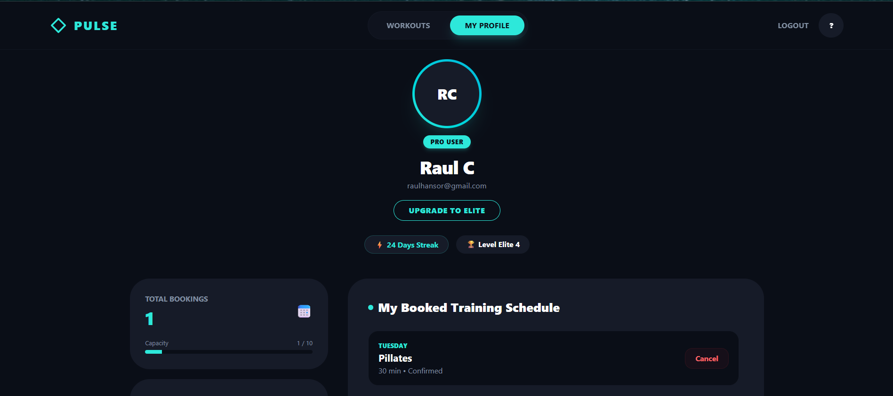
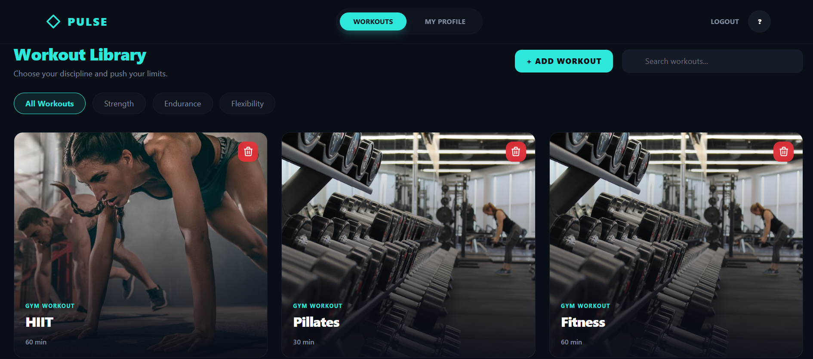

# GymFit (Pulse)

A full-stack web application built to manage gym memberships, workouts, and class schedules. Regular users can browse available sessions, track their fitness stats, and book spots, while administrators can manage trainers, classes, and users through a dedicated dashboard interface.

---

## Tech Stack

* **Frontend:** React, Tailwind CSS, Axios, jwt-decode, react-hot-toast
* **Backend:** ASP.NET Core Web API, Entity Framework Core (Code First approach)
* **Database:** PostgreSQL
* **Auth:** ASP.NET Core Identity + JWT Bearer Tokens

---

## Application Preview

### User Dashboard & Stats

### Live Workout Library

### Admin HQ Control Panel

---

## Features

* **Authentication & Role-Based UI:** Secure registration and login handling with hashed passwords via Identity. The frontend reads the roles from the decoded JWT token to dynamically display components and protect routes (`PrivateRoute` and `AdminRoute`).
* **User Profile & Stats:** A dedicated dashboard page where users can track their workout stats (total bookings, active streak, and average session duration) and view their upcoming training schedule.
* **Booking System:** Regular users can join or cancel workout sessions. Joining a class automatically updates the available seat capacity in the database, and canceling a session frees up the spot instantly.
* **Admin Dashboard:** A multi-tab interface built for users with the Admin role to manage backend data directly from the UI:
    * *Trainers Management:* Add new fitness coaches to the platform or remove them.
    * *Class Scheduler:* Create new workout classes, set duration/max capacity, and assign a trainer from a dynamic dropdown.
    * *User List:* View all registered accounts and see their current membership tier (Free/Pro/Elite).
* **Live Filtering:** A search bar and category buttons (Strength, Endurance, Flexibility) to filter gym classes in real-time without reloading the page.

---
